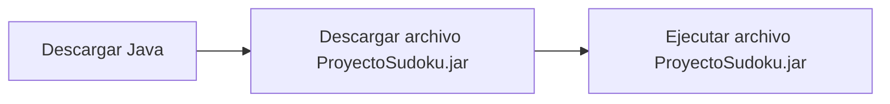
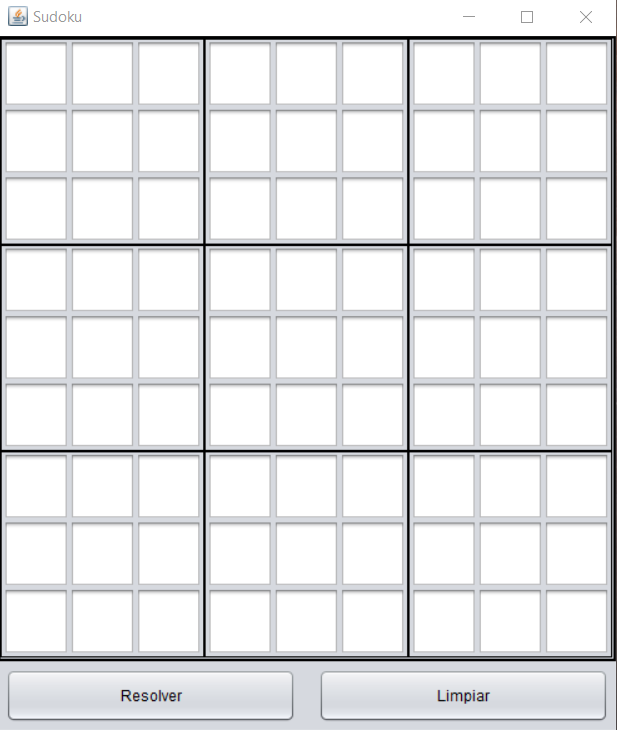
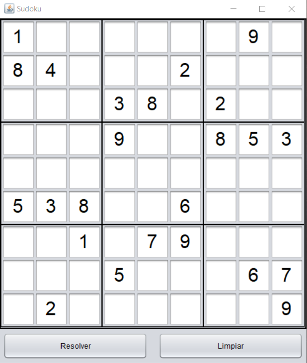
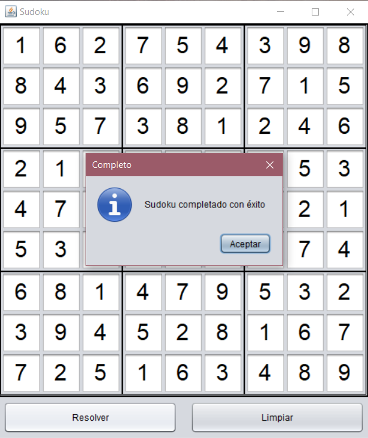

# Sudoku-Solver
Solucionador de juegos de Sudoku desarrollado en Java. El programa tiene una interfaz gráfica que replica la apariencia de un juego de Sudoku convencional, y añade la funcionalidad de resolver automáticamente el juego.

## Table of contents
* [Información general](#información-general)
* [Configuración](#configuración)
* [Tutorial](#tutorial)
* [Características](#características)
* [Status](#status)

## Información general
El programa fue desarrollado en Java para la clase "Estructura de Datos" del Instituto Tecnológico Autónomo de México. Se utilizó NetBeans para facilitar el desarrollo de la interfaz gráfica.

## Configuración
Primero, asegúrese de tener la última versión de [Java](https://www.java.com/es/download/).
Para empezar a utilizar el programa, descargue y ejecute el archivo [ProyectoSudoku.jar](./ProyectoSudoku.jar).

## Tutorial
Ejecute el programa.

Ingrese los números del problema a resolver.

Presione el botón resolver para obtener una solución.

Presione el botón limpiar para poder ingresar un nuevo problema.

## Características
Lista de características del programa
* Interfaz gráfica fácil de usar
* Capaz de resolver una amplia variedad de problemas
* Reinicio rápido para buscar nuevas soluciones

## Status
Este proyecto está terminado.
